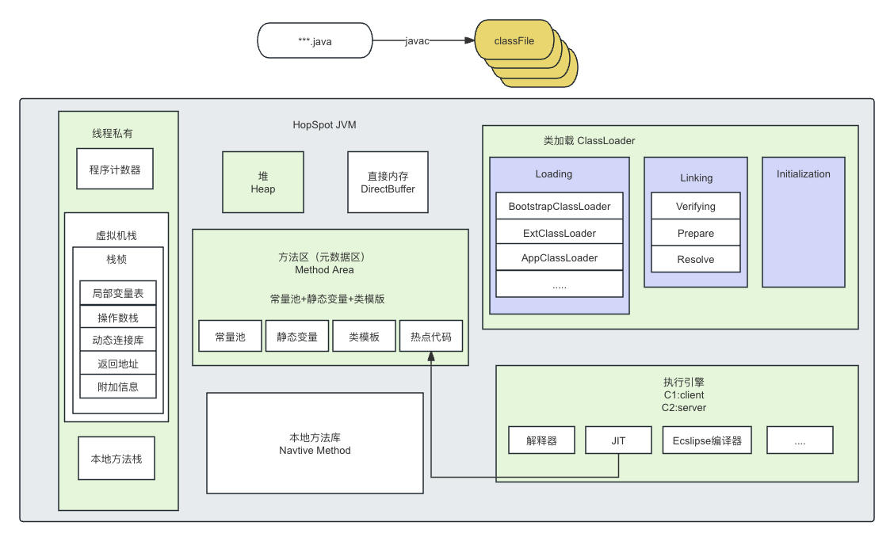

# 为什么要学JVM

> 首先：面试需要。面试题层出不穷，难道每次面试都靠背几百上千条面试八股文？
>
> 其次：基础决定上层建设。自己写的代码都不知道是怎么回事，怎么可能写出靠谱的系统？
>
> 然后：学习JVM也是进行JVM调优的基础。写的代码放到线上要如何运行？要配多少内存？4G够不够？线上环境出问题了，服务崩溃，怎么快速定位？怎么解决问题？
>
> 总之，学不学JVM，是能自主解决问题的一流程序员与跟着别人做CURD的二流程序员的分水岭！二流程序员会觉得学JVM无关紧要，反正开发也用不上。做开发我只要学框架就行了，而一流程序员都在尽自己能力把JVM每个底层逻辑整理成自己的知识体系。

-  一个java文件整体执行过程

- Class文件规范 
  - Class文件结构
  
  > 实际上，我们需要了解的是，Java官方实际上只是定义了JVM的一种规范，也就是class文件的组织规范。理论上，只要你能够写出一个符合标准的class文件，就可以丢到JVM中执行。至于这个class文件是怎么来的，JVM虚拟机是不管的。这也是JVM支持多语言的基础。
  >
  > 这个规范到底是什么样子呢？see： https://docs.oracle.com/javase/specs/jvms/se8/html/index.html
  >
  > 首先，我们要知道，class文件本质是一个二进制文件，虽然不能直接用文本的方式阅读，但是我们是可以用一些文本工具打开看看的。