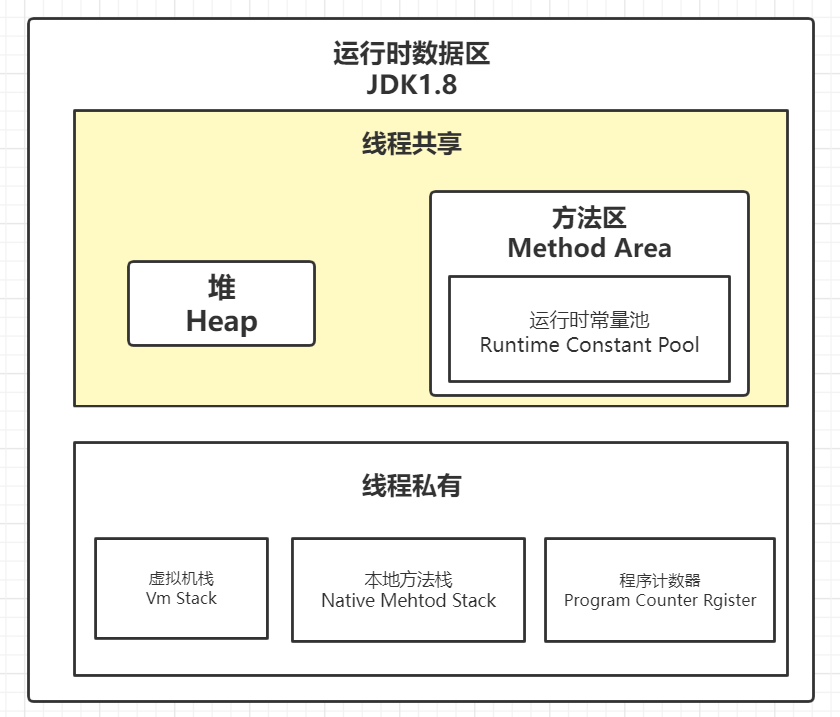

## 内存模型

**线程私有**

- 虚拟机栈
- 本地方法栈
- 程序计数器

**线程共享**

- 堆
- 方法区
- 直接内存

### 程序计数器

- 程序计数器是一块较小的内存空间，它可以看作是当前线程所执行的 字节码的行号指示器。
  **字节码解释器工作时就是通过改变这个计数器 的值来选取下一条需要执行的字节码指令，它是程序控制流的指示器，分支、循环、跳转、异常处 理、线程恢复等基础功能都需要依赖这个计数器来完成。**

- 另外，**为了线程切换后能恢复到正确的执行位置，每条线程都需要有一个独立的程序计数器，各条线程之间计数器互不影响，独立存储，我们称这类内存区域为“线程私有”的内存。**

**注意：程序计数器是唯一一个不会OutOfMemoryError的内存区域，它的生命周期随着线程的创建而创建，随着线程的结束而死亡。**

### Java虚拟机栈

  - 它的生命周期与线程相同.
  - 虚拟机栈描述的是Java方法执行的内存模型,
  - 虚拟机栈描述的是Java方法执行的线程内存模型：每个方法在执行的同时都会创建一个栈帧（Stack Frame)用于存储局部变量表、操作数栈、动态链接、方法出口等信息.
  - 每一个方法从调用直至执行完成的过程，就对应着一个栈帧在虚拟机栈中入栈到出栈的过程.

