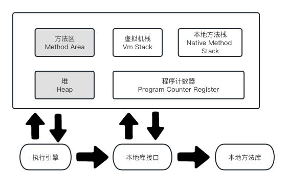

### 内存结构

> 1.8与1.7的区别是元数据区取代了永久代。元数据区本质和永久代类似，都是JVM规范中方法区的实现。  
> 元数据区和永久代最大的区别就是，元数据区不在虚拟机中，而是在本地内存。

- 程序计数器

  > 程序计数器是一块较小的内存，是当前线程正在执行的字节码指令地址。若当前正在执行的是一个本地方法，那么此时程序技术器为`Undefined`
  
  - 程序计数器的作用
    1. 字节码解释器通过改变程序计数器来依次读取指令，从而实现代码的流程控制。
    1. 多线程情况下，程序计数器记录的是当前线程执行的位置。以便于线程切换回来时，就知道上次执行到哪了。
  
  
  - 程序计数器的特点
    1. 是一块较小的内存
    1. 线程私有，每条线程都有自己的程序计数器
    1. 生命周期，随线程创建而创建，随线程结束而销毁
    1. 唯一一个不会出现的 `OutOfMemoryError` 内存区域
  

- 本地方法栈

> 本地方法区是为JVM运行Native方法准备的空间，由于很多方法都是用C语言实现的，所以叫它C栈。它与Java虚拟机栈实现的功能类似，只不过本地方法栈描述的是本地方法运行的内存模型。

- 虚拟机栈
  - 线程私有
  - 每个方法被执行的时候，JVM都会创建一个栈帧用于存储局部变量表、操作数栈、动态连接、方法出口等信息

- 堆
  - 线程共享
  - 垃圾回收在此区域
- 方法区
  - 用于存储

