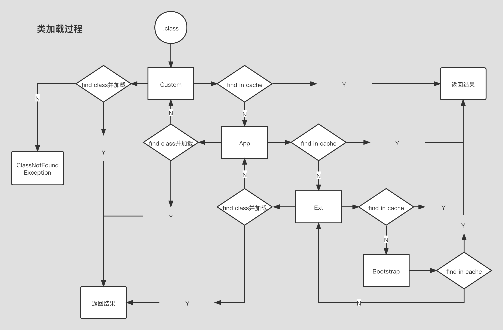

## 加载过程

- 加载
  > 1. 双亲委派，主要出于安全考虑
  > 2. LazyLoading 五种情况  
       1. new getstatic pubstatic invokestatic指令，访问final变量除外  
       2. java.lang.reflect对类进行反射调用时  
       3. 初始化子类时，父类首先初始化  
       4. 虚拟机启动时，被执行的主类必须初始化  
       5. 动态语言支持java.lang.invoke.MethodHandler
    3. ClassLoader源码
        1. findInCache -> parent.loadClass -> findClass
    4. 自定义类加载器
        1. extends ClassLoader
        2. 重写findClass() -> defineClass
        3. 加密
    5. 执行问题
        1. 混合执行 -Xmixed (默认)
            1. 混合使用解释器 + 热点代码编译
            2. 起始阶段采用解释执行
            3. 热点代码检测（HotSpot），默认-XX:CompileThreshold=10000
                1. 多次被调用的方法（方法计数器：监测方法执行频率）
                2. 多次被调用的循环（循环计数器：监测循环执行频率）
            4. 对热点代码进行编译
        2. 编译执行 -Xcomp
            1. 由JIT（Just In-Time Compiler）编译为本地代码（C语言实现）执行
            2. 启动慢 执行快
        3. 解释执行 -Xint
            1. 通过编译器（bytecode interceptor）解释执行
            2. 启动快 执行慢

- 连接
    - 验证

      > 校验文件是否符合JVM规定
    - 准备（重要）

      > 静态成员变量赋默认值
    - 解析（重要）

      > 将类、方法、属性等符号引用解析为直接引用  
      常量池中的各种符号引用解析为指针、偏移量等内存地址的直接引用

- 初始化

  > 调用类初始化代码，给静态成员变量赋初始值

## 总结

> load -> 默认值 -> 初始值  
> new -> 申请内存 -> 赋默认值 -> 赋初始值

## 类加载过程图

