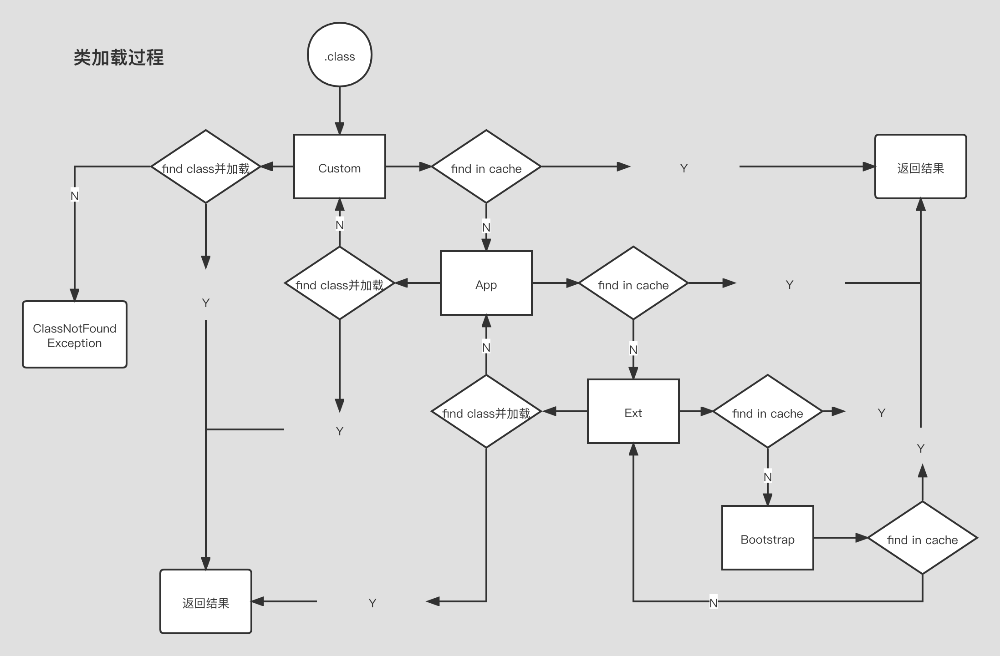

# 类加载

## 加载过程

- 加载
  > 1. 双亲委派，主要出于安全考虑
  > 2. LazyLoading 五种情况  
       1. -new getstatic pubstatic invokestatic指令，访问final变量除外  
       2. -java.lang.reflect对类进行反射调用时  
       3. -初始化子类时，父类首先初始化  
       4. -虚拟机启动时，被执行的主类必须初始化  
       5. -动态语言支持java.lang.invoke.MethodHandler
    3. ClassLoader源码
        1. findInCache -> parent.loadClass -> findClass
    4. 自定义类加载器
        1. extends ClassLoader
        2. 重写 findClass() -> defineClass
        3. 加密
    5. 混合执行 编译执行 解释执行

- 连接
    - 验证

      > 验证被加载文件的正确性
    - 准备

      > 为类变量分配内存并赋初始值（数据类型的默认值），分配在方法区
    - 解析

      > 把符号引用转换为直接访问的地址

- 初始化

  >

## 类加载过程

