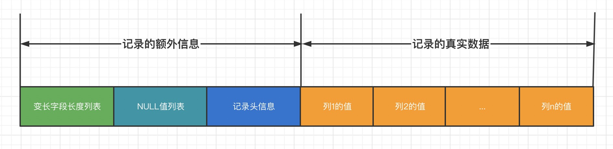
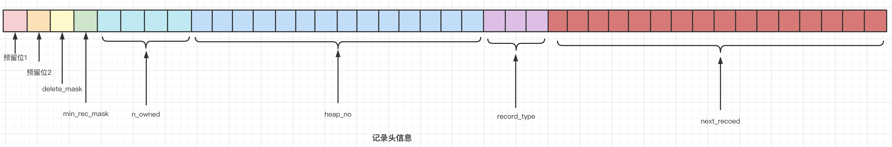

### InnoDB行格式

> 目前Mysql有四种行格式：Compact、Redundant、Dynamic、Compressed

|   行格式   | 紧凑存储 | 增强的可变长度列存储 | 大索引前缀支持 | 支持压缩 |
| :--------: | :------: | :------------------: | :------------: | :------: |
|  Compact   |    否    |          否          |       否       |    否    |
| Redundant  |    是    |          否          |       否       |    否    |
|  Dynamic   |    是    |          是          |       是       |    否    |
| Compressed |    是    |          是          |       是       |    是    |

#### Compact

> Compact行格式一条记录分为两部分：记录的额外信息和记录的真实数据
>
> 记录的额外信息分别是：变长字段长度列表、NULL值列表和记录头信息。

##### 变长字段长度列表

> 在Compact行格式中，把所有变长字段的真实数据占用的字节长度都存放在记录的开头部位，从而形成一个变长字段列表，各变长字段数据占用的字节数按照列的顺序**逆序**存放

##### NULL值列表

1. 统计表中允许存储NULL的列
2. 如果表中没有允许存储NULL的列，则NULL值列表也不存在了

##### 记录头信息

> 由固定的5个字节（40个二进制位）组成。

##### 记录真实的数据

> 记录的真实数据除了自定义的列的数据以外，也会默认记录一些列（隐藏列）
>
> 隐藏列：DB_ROW_ID(行id)、DB_TRX_ID(事物id)、DB_ROLL_PTR(回滚指针)