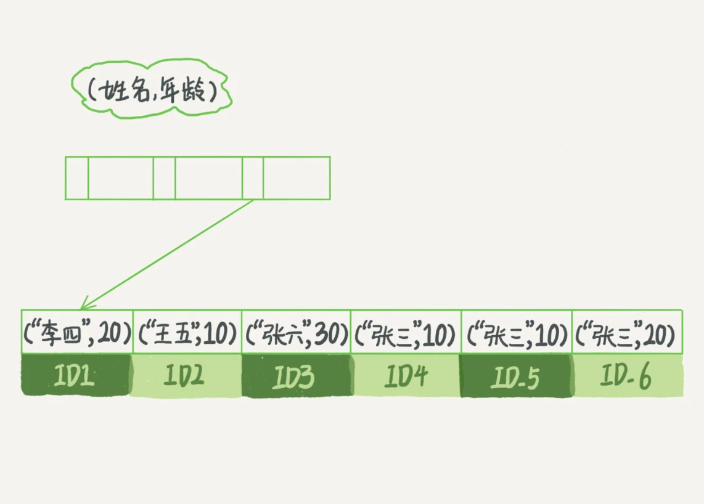

## 索引

可以提高数据查询的效率，索引是在存储引擎层实现的 索引使用的数据结构是B+树

- 索引类型分为主键索引和非主键索引
  > 主键索引的叶子节点存的是整行数据，在Innodb里，主键索引也叫聚簇索引
  > 非主键索引存的叶子节点内容是主键的值， 在Innodb里，非主键索引也叫二级索引

- 基于主键索引和普通索引的查询有什么区别？
  > 主键索引查询方式，只需要搜索id这棵索引树
  > 普通索引查询方式，需要先搜索普通索引树，得到id，再到id索引树查询一遍。这个过程叫做回表

## 索引维护

- 插入新值的时候需要维护B+树，如果新的行id比最大的id要大，就直接在记录后面插入一个新纪录，如果新插入的id在中间，就需要逻辑上挪动后面的数据，空出位置。
  当数据页满了，就需要申请一个新的数据页，这个过程叫做页分裂。这种情况下，性能会受到影响。


- 除性能外，页分裂操作还影响数据页的利用率。原本放在一个页的数据，现在分到两个页中，整体空间利用率降低大约 50%。


- 反之，相邻两个数据页删除了数据，利用率很低之后，会将数据页合并。合并的过程，可以认为是分裂过程的逆过程。

### 覆盖索引

查询语句中查询结果字段中包含主键列，查询结果可以直接返回，不需要回表，这个过程叫做覆盖索引。 由于覆盖索引可以减少树的搜索次数，显著提升查询性能，所以使用覆盖索引是一个常用的性能优化手段。

### 最左前缀原则


> 索引项是按照索引定义里面出现的字段顺序排序的。

#### 创建联合索引

- 第一原则是，如果通过调整顺序，可以少维护一个索引，那么这个顺序往往就是需要优先考虑采用的。
- 二就是要考虑空间问题。

### 索引下推

MySQL 5.6 引入的索引下推优化（index condition pushdown)， 可以在索引遍历过程中，对索引中包含的字段先做判断，直接过滤掉不满足条件的记录，减少回表次数。

### 查询过程

- 例子
  ```mysql
     select id from T where k = 5
  ```

  > 这个查询语句在索引树上查找的过程，先是通过 B+ 树从树根开始，按层搜索到叶子节点。
  - 对于普通索引来说，查找到满足条件的第一个记录 (5,500) 后，需要查找下一个记录，直到碰到第一个不满足 k=5 条件的记录。
  - 对于唯一索引来说，由于索引定义了唯一性，查找到第一个满足条件的记录后，就会停止继续检索。
  > 总结:
  > 普通索引跟唯一索引执行上的区别： 普通索引的等值查询，会继续遍历到第一个不相等的值才会结束，而唯一索引等值查询，命中则结束（性能差距微乎其微）

InnoDB 的数据是按数据页为单位来读写的。也就是说，当需要读一条记录的时候，并不是将这个记录本身从磁盘读出来，而是以页为单位，将其整体读入内存。在 InnoDB 中，每个数据页的大小默认是 16KB。

### 更新过程

- change buffer
  - 当需要更新一个数据页时，如果数据页在内存中就直接更新，而如果这个数据页还没有在内存中的话，在不影响数据一致性的前提下，InnoDB 会将这些更新操作缓存在 change buffer
    中，这样就不需要从磁盘中读入这个数据页了。在下次查询需要访问这个数据页的时候，将数据页读入内存，然后执行 change buffer 中与这个页有关的操作。通过这种方式就能保证这个数据逻辑的正确性。
  - change buffer可以看成也是一个数据页，需要被持久化到 系统表空间（ibdata1），以及把这个change buffer页的改动记录在redo log里，事后刷进系统表空间（ibdata1）。
  - 将 change buffer 中的操作应用到原数据页，得到最新结果的过程称为 merge。除了访问这个数据页会触发 merge 外，系统有后台线程会定期 merge。在数据库正常关闭（shutdown）的过程中，也会执行
    merge 操作。
  - 如果能够将更新操作先记录在 change buffer，减少读磁盘，语句的执行速度会得到明显的提升。而且，数据读入内存是需要占用 buffer pool 的，所以这种方式还能够避免占用内存，提高内存利用率。
  - change buffer的目的就是将记录的变更动作缓存下来

> 唯一索引无法使用change buffer，所有更新操作都要先判断是否违反唯一性约束，判断唯一性约束，先要判断表中是否存在该记录，这操作必然要把数据页读入内存中才能进行。
> 如果都已经读到内存，那直接更新会更快，就没必要使用change buffer了。

> change buffer是buffer pool里的内存，因此不能无限增大，change buffer的大小可以通过参数innodb_change_buffer_max_size 来动态设置。

- change buffer 和 redo log
  - redo log是物理日志，记录的是数据页的修改。
  - change buffer在内存，如果修改的不是唯一索引，是普通索引，就不用再去磁盘随机IO了，直接将这个修改记录再change buffer中。
  - 也可以理解为，数据页在内存，那就修改数据页，再写redo log，如果数据页不在内存中，修改的也不是唯一索引，那就写change buffer，并把这个change buffer写入到redo log，防止更新丢失。

> redo log 主要节省的是随机写磁盘的 IO 消耗（转成顺序写），而 change buffer 主要节省的则是随机读磁盘的 IO 消耗。
