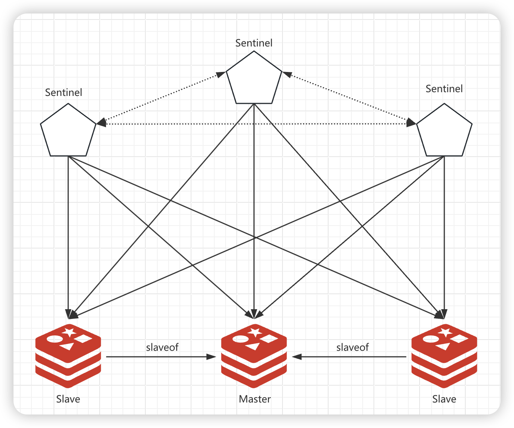
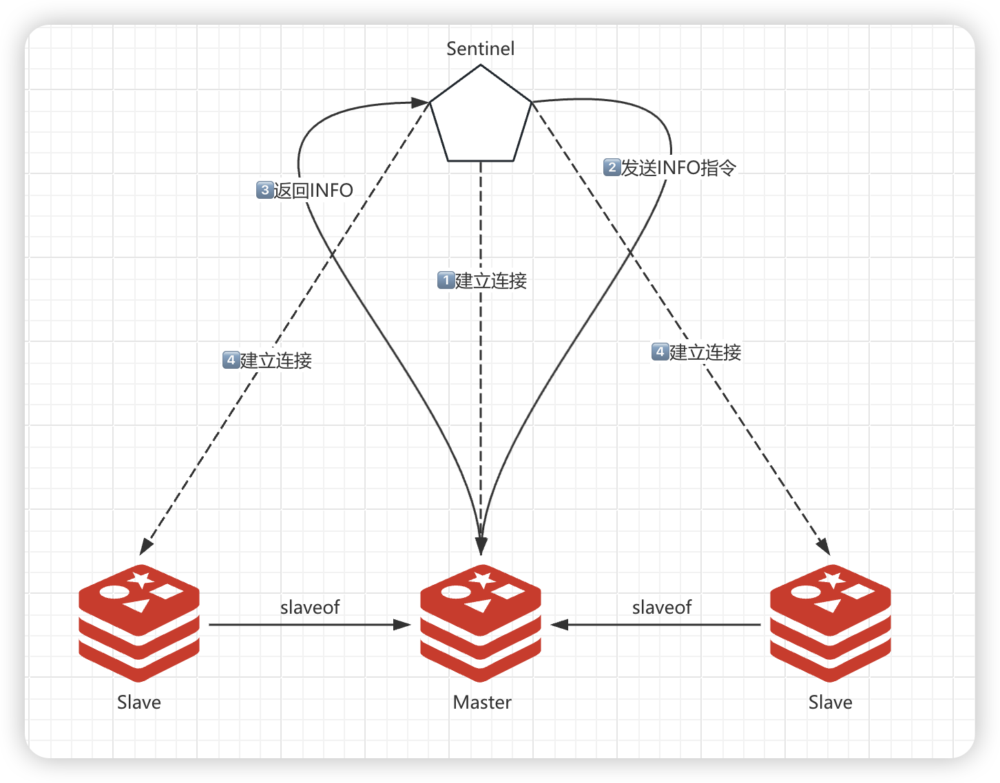

## 介绍

> 监控后台的**预警者**负责持续检查主服务器（master主机）的运行状态。一旦发现主服务器出现故障，系统将启动一个自动化的切换机制。这个机制会根据预设的投票规则，从多个备用服务器（从库）中选择一个来接替主服务器的角色。被选中的备用服务器将升级为新的主服务器，并继续无缝地对外提供服务，确保整个系统的持续稳定运行。这种机制有效避免了单点故障带来的风险，并提升了系统的整体可靠性和容错能力。


##  架构

> 哨兵集群独立于 Redis 集群，哨兵之间彼此建立连接，共同监控、管理所有的 Redis 节点。




## 作用

- **监控**

  > Sentinel会不断的检查你的主节点和从节点是否正常工作。

- **故障转移**

  > 当哨兵发现主节点下线时，会在所有从节点中选择一个作为新的主节点，并将所有其他节点的 Master 指向新的主节点。同时已下线的原主节点也会被降级为从节点，并修改配置将 Master 指向新的主节点，等到它重新上线时就会自动以从节点进行工作。

- **通知**

  > 被监控的Redis实例如果出现问题，Sentinel可以通过API（pub）通知系统管理员或者其他程序。

- **配置提供**

  > **客户端可以把 Sentinel 作为权威的配置发布者来获得最新的maste 地址。如果发生了故障转移，Sentinel集群会通知客户端新的master地址，并刷新 Redis 的配置。**（sentinel会返回最新的master地址）


## 原理


### 从库发现

> 对于哨兵的配置，我们只需要配置主库的信息，哨兵在连接主库之后，会调用 `INFO` 命令获取主库的信息，再从中解析出连接主库的从库信息，再以此和其他从库建立连接进行监控。



INFO 中的 Replication 信息：

```shell
#Replication
role:master         
connected_slaves:2
slave0:ip=172.25.0.102,port=6379,state=online,offset=258369,lag=1
slave1:ip=172.25.0.103,port=6379,state=online,offset=258508,lag=0 
master_failover_state:no-failover 
master_replid:a4a6a7f3b2e15d9a43c01d4ba6c842539e582d6a 
master_replid2:0000000000000000000000000000000000000000
master_repl_offset:258508 
second_repl_offset:-1 
repl_backlog_active:1 
repl_backlog_size:1048576 
repl_backlog_first_byte_offset:1 
repl_backlog_histlen:258508
```

哨兵对所有节点都会每隔 10s 发送一次 `INFO` 命令，从各节点获取 Redis 集群实时的拓扑图信息。如果新节点加入，哨兵就会去监控新的节点。


订阅后，每个哨兵每隔 2 秒都会向 `hello` 频道发布一条携带自身信息的 hello 信息，这样哨兵就能知道其他哨兵的状态、监控的主节点和是否有新的哨兵加入：

```shell
127.0.0.1:6371> subscribe __sentinel__:hello
Reading messages... (press Ctrl-C to quit)
1) "subscribe"
2) "__sentinel__:hello"
3) (integer) 1
1) "message"
2) "__sentinel__:hello"
3) "172.25.0.202,26379,5134e342cc62ac76494c140b66b7fda80340e3a8,0,mymaster,172.25.0.101,6379,0"
1) "message"
2) "__sentinel__:hello"
3) "172.25.0.203,26379,5f5ce54a6f22f71c7d273cfb9eb14377b103d4ad,0,mymaster,172.25.0.101,6379,0"
1) "message"
2) "__sentinel__:hello"
3) "172.25.0.201,26379,4fa3486dfbaca9abc62b2976e821d18e697ab2db,0,mymaster,172.25.0.101,6379,0"
```


### 主观下线

> 一个服务器必须在 master-down-after-milliseconds 毫秒内， 一直返回无效回复才会被 Sentinel 标记为主观下线。


- **在Sentinel哨兵的运行阶段，(其会向其他的Sentinel哨兵、master和slave发送消息确认其是否存活)，如果在指定的时间内未收到正常回应，暂时认为对方挂起了（被标记为主观宕机–SDOWN）**
  - **注意：当只有单个sentinel实例对redis实例做出无响应的判断，此时进入主观判断，不会触发自动故障转移等操作。**


### 客观下线

> 当多个Sentinel哨兵(数量由quorum参数设定)都报告同一个master没有响应了，通过投票算法(Raft算法)，系统判断其已死亡（被标记为客观宕机–ODOWN）。

- **多个 Sentinel 实例在对同一个服务器做出 SDOWN 判断， 并且通过 SENTINEL is-master-down-by-addr 命令互相交流之后， 得出的服务器下线判断。**
- **Sentinel可以通过向另一个 Sentinel 发送 SENTINEL is-master-down-by-addr 命令来询问对方是否认为给定的服务器已下线。**


### Sentinel下线操作

- 从主观下线状态切换到客观下线状态并没有使用严格的法定人数算法（strong quorum algorithm）， 而是使用了流言协议： **如果 Sentinel 在给定的时间范围内(master_down_after_milliseconds)， 从其他 Sentinel 那里接收到了足够数量的主服务器下线报告**， 那么 Sentinel **就会将主服务器的状态从主观下线改变为客观下线**。 **如果之后其他 Sentinel 不再报告主服务器已下线， 那么客观下线状态就会被移除。**

- **客观下线条件只适用于主服务器： 对于任何其他类型的 Redis 实例（其他sentinel和slave服务节点）**， Sentinel 在将它们判断为下线前不需要进行协商， **所以从服务器Slave或者其他 Sentinel 永远不会达到客观下线条件**


### 主从切换

> 此时Sentinel集群会选取领头的哨兵（leader）进行故障恢复，从现有slave节点中选出一个提升为Master，并把剩余Slave都指向新的Master，继续维护主从关系


### 自动发现机制

> 每个Sentinel使用发布/订阅的方式**持续地传播master的配置版本信息**，配置传播的**发布/订阅管道是: sentinel:hello，我们可以通过订阅其频道查看频道中的消息**


### Sentinel的发现方式

> 原理中提及到了，当sentinel发现主库客观下线时候会进行**领头哨兵选举**（**超过半数切大于阈值**）进行故障恢复，**其选举算法采用Raft算法**，这也为什么说其设计思想类似与zookpeer

- **发现主库客观下线的哨兵节点（这里称为A）向每个哨兵节点发送命令要求对方选举自己为领头哨兵（leader）**
- **如果目标哨兵没有选举过其他人，则同意将A选举为领头哨兵**
- **如果A发现有超过半数且超过quorum参数值的哨兵节点同意选自己成为领头哨兵，则A哨兵成功选举为领头哨兵**
  - sentinel集群执行故障转移时需要选举leader，此时涉及到majority，majority 代表 sentinel 集群中大部分 sentinel 节点的个数，只有大于等于 max(quorum, majority) 个节点给某个 sentinel 节点投票，才能确定该sentinel节点为leader，majority 的计算方式为：num(sentinels) / 2 + 1
- **当有多个哨兵节点同时参与领头哨兵选举时，出现没有任何节点当选可能，此时每个参选节点等待一个随机时间进行下一轮选举，直到选出领头哨兵**


### 故障恢复时从Slave中间选出Master的算法

> 主要根据slave-priority进行排序做控制选举，先比较slave_offset值越大优先级越高，如果相等在获取runid最小的（代表启动时间越早）。

- 按照slave优先级进行排序**，**slave-priority越低，优先级就越高
- 如果slave priority相同，那么比较复制偏移量，offset越靠后（越大）则表明和旧的主库数据同步越接近，优先级就越高
- 如果上面两个条件都相同，那么选择一个run id最小的从库


### Sentinel（哨兵）的运作流程

1. 每个Sentinel以每秒钟一次的频率向它所知的Master，Slave以及其他 Sentinel 实例发送一个 PING 命令**。(**心跳机制)
2. 如果一个实例（instance）距离最后一次有效回复 PING 命令的时间超过 down-after-milliseconds 选项所指定的值， 则这个实例会被 Sentinel 标记为主观下线
3. 如果一个Master被标记为主观下线，则正在监视这个Master的所有 Sentinel 要以每秒一次的频率确认Master的确进入了主观下线状态**。（**确认投票下线）
4. 当有足够数量的 Sentinel（大于等于配置文件指定的值）在指定的时间范围内确认Master的确进入了主观下线状态， 则Master会被标记为客观下线
5. 在一般情况下， 每个 Sentinel 会以每 10 秒一次的频率向它已知的所有Master，Slave发送 INFO 命令。（同步数据）
6. 当Master被 Sentinel 标记为客观下线时，Sentinel 向下线的 Master 的所有 Slave 发送 INFO 命令的频率会从 10 秒一次改为每秒一次
7. 若没有足够数量的 Sentinel 同意 Master 已经下线， Master 的客观下线状态就会被移除
8. 若 Master 重新向 Sentinel 的 PING 命令返回有效回复， Master 的主观下线状态就会被移除


## Sentinel部署配置

```shell
#工作端口
port 26379

#工作目录
dir "/var/lib/redis/sentinel"

#sentinel id ，建议注释掉，会自动生成
#sentinel myid 827f0104ad153f34db5a29b8cbb51ef21a31d6d5

#配置要监控的master名字和地址，最后一个2代表当sentinel集群中有2个sentinel认为master故障时候才判定master真正不可用。
#官方把该参数称为quorum，在后续选举领头哨兵时候会用到
sentinel monitor mymaster 10.130.2.155 6379 2

#配置master密码：配置主服务器的密码(如没设置密码，可以省略)  
sentinel auth-pass mymaster Password

#日志
logfile "/var/log/redis/sentinel.log"

#Sentinel可以调整的相关参数

#主观SDOWN时间，单位毫秒，默认30秒。（心跳检测）
sentinel down-after-milliseconds mymaster 30000

#在发生failover主备切换时候，最多允许多少个slave同时同步新的master。这个数字越小，完成failover所需的时间就越长，但是如果这个数字越大，就意味着越多的slave因为replication而不可用。可以通过将这个值设为 1 来保证每次只有一个slave处于不能处理命令请求的状态。
sentinel parallel-syncs mymaster 1

#failover-time超时时间，当failover开始后，在此时间内仍然没有触发任何failover操作，当前sentinel将会认为此次failover失败，单位毫秒。默认3分钟。
sentinel failover-timeout mymaster 180000
```

