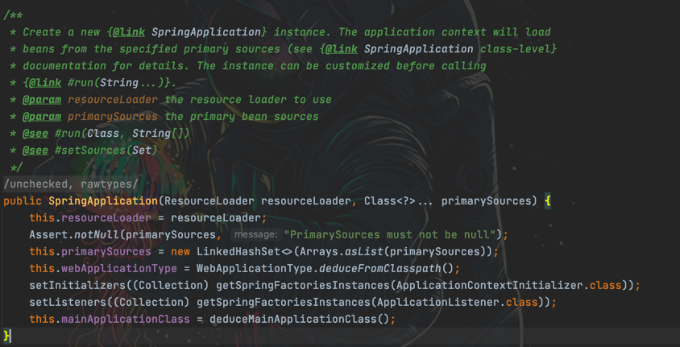

## SpringBoot Run源码解析

### new SpringApplication

- 配置resourceLoader
- WebApplicationType.deduceFromClasspath() 判断当前应用成程序的类型（REACTIVE、NONE、SERVLET）
- 获取初始化容器的实例对象  setInitializers
  > 1.先从缓存中获取，如果非空直接返回 
  > 2.加载META-INF/spring.factories 
  > 3.加载完成，放到缓存中（cache.put(classLoader, result);） 返回数据Set 
  > 4.createSpringFactoriesInstances 实例化对象 （反射） 
  > 5.AnnotationAwareOrderComparator.sort  排序 
- 初始化监听器 setListeners （同上）
- 找到当前应用程序主类  开始执行

